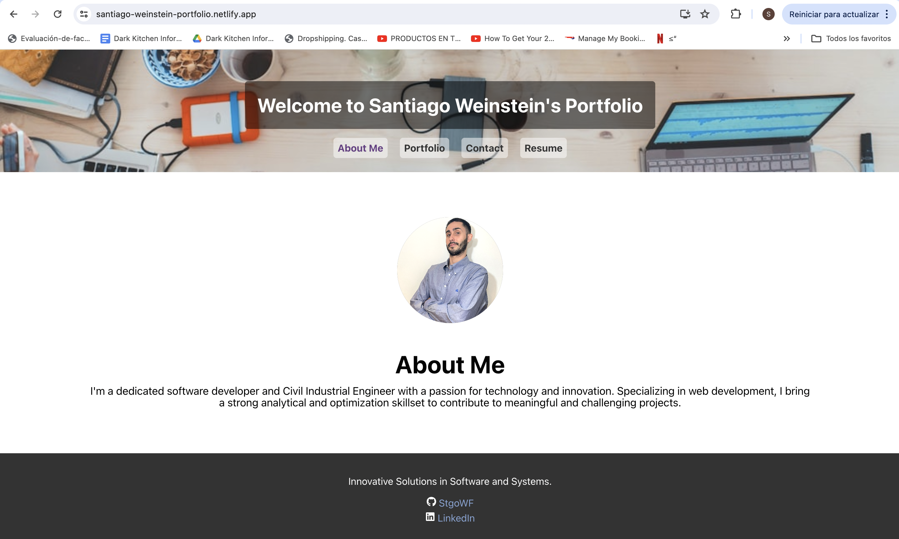

# Santiago Weinstein's Portfolio

## Description

This is a portfolio website built with React to showcase my projects and skills as a web developer. The portfolio includes sections for About Me, Portfolio, Contact, and Resume. It uses modern technologies and is deployed on Netlify.

## Screenshot



## Deployed Application

You can view the deployed application at the following link:

[Deployed Portfolio](https://santiago-weinstein-portfolio.netlify.app/)

## Sections

### About Me

A brief introduction showcasing key skills and experiences.

### Portfolio

A showcase of my projects, including links to the deployed applications and their corresponding GitHub repositories.

### Contact

A contact form with fields for name, email address, and message. The form validates input and sends an email using EmailJS.

### Resume

A downloadable resume and a list of my proficiencies in front-end and back-end technologies.

## Technologies Used

- React
- EmailJS
- CSS
- HTML
- Netlify

## How to Run Locally

1. Clone the repository:
    ```bash
    git clone https://github.com/yourusername/your-repo-name.git
    ```
2. Install dependencies:
    ```bash
    cd your-repo-name
    npm install
    ```
3. Run the development server:
    ```bash
    npm start
    ```

## Contact

For any questions or inquiries, please contact me at [stgoweinsteinf@gmail.com](mailto:stgoweinsteinf@gmail.com).

## License

This project is licensed under the MIT License.
